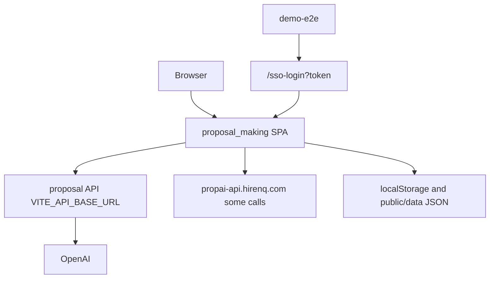
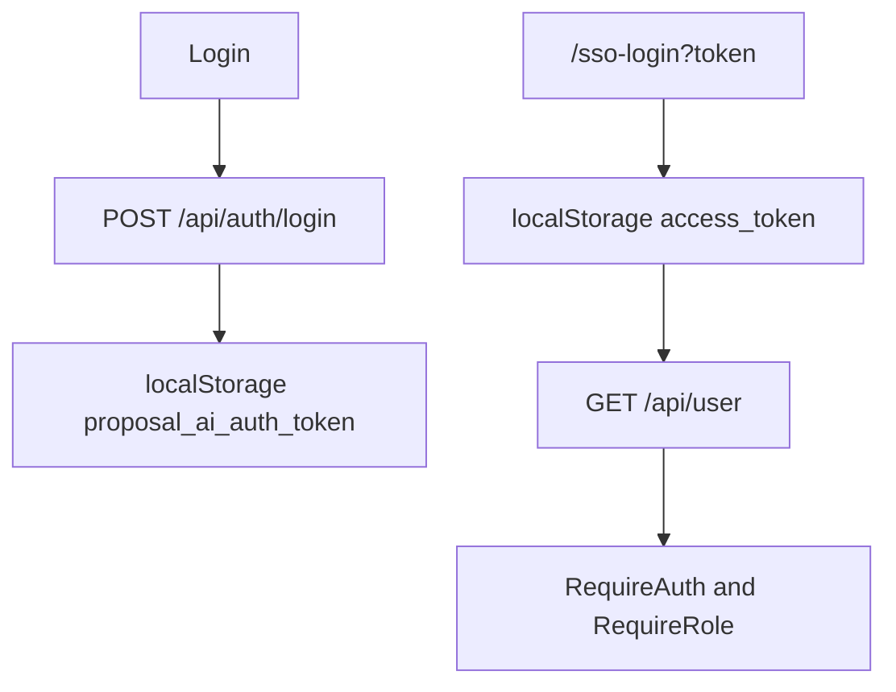
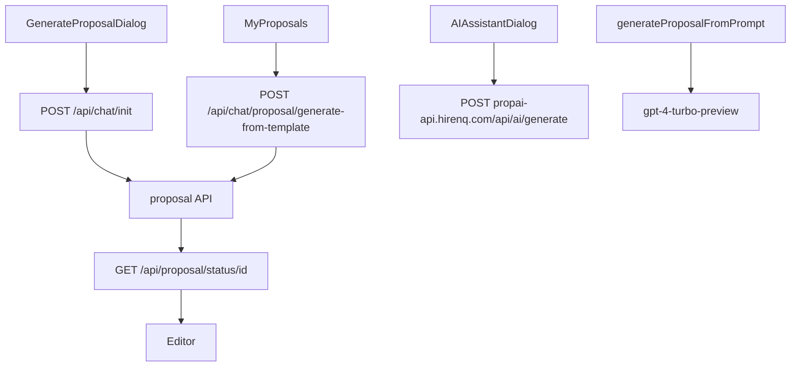
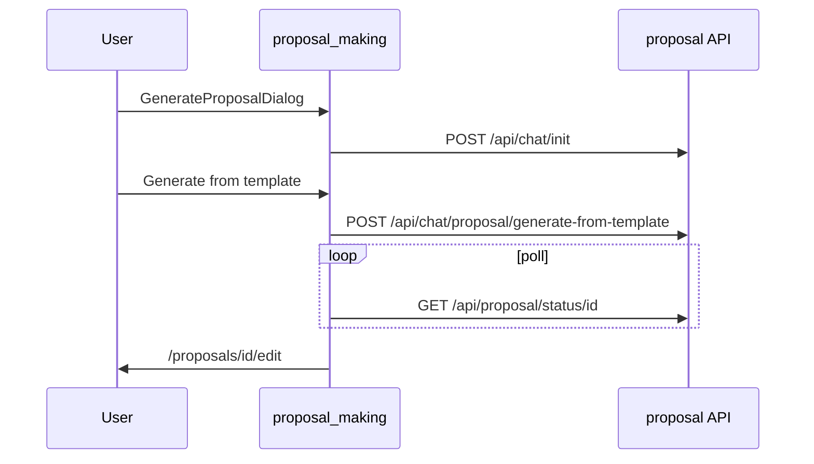
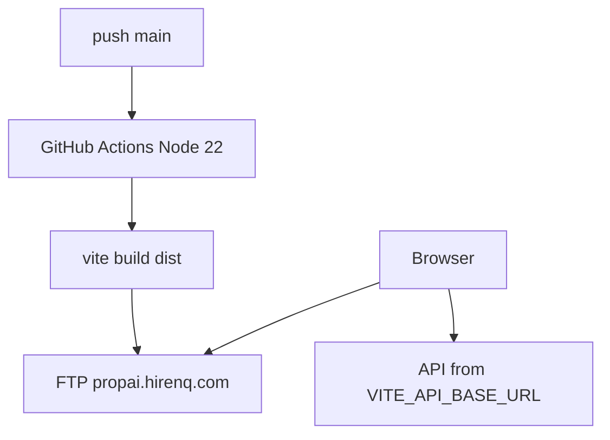

# Project Specification

Confidence labels:

- **Confirmed from code**
- **Inferred from code**
- **Not identified in the current codebase**

The directory name is `proposal_making`. A folder named `proposal-making` was **not identified**.

## 1. Project Overview

| Item | Detail |
| ---- | ------ |
| Project name | `package.json` name `fusion-starter`. UI copy brands the product Pitchsuite (marketing pages and proposal editor). |
| Project purpose | **Confirmed from code.** React SPA for marketing pages, login, SSO handoff, proposal editing, templates, clients, admin screens, and public proposal/PPT links. Data and AI generation are loaded from a remote HTTP API. |
| Current implementation status | Vite application with pages and services. One Vitest file. Production workflow deploys `dist/` by FTP. Express and Netlify function files exist and are not wired into the Vite dev server. |
| Primary technology stack | React 18, React Router 6, Vite 7, Tailwind, Axios. |
| Framework and versions | `react` ^18.3.1, `react-router-dom` ^6.30.1 (from the earlier package listing; router is imported in `App.tsx`), `vite` ^7.1.2, `@tanstack/react-query` ^5.84.2, `axios` ^1.18.1, `express` ^5.1.0, `typescript` ^5.9.2, `vitest` ^3.2.4, `zod` ^3.25.76, `html2pdf.js` ^0.12.1. Package manager field `pnpm@10.14.0`. CI uses Node 22. |
| Runtime requirements | Node for `vite` / `pnpm`. No database process. Browser calls a remote API. |
| Main responsibilities | Render screens, store JWT in `localStorage`, call the proposals API, poll generation status, export PDF in the browser. |
| Relationship with other projects | **Confirmed from code:** default API base `https://api.dev.pitchsuite.io` matches the Laravel app in `proposal` (`routes/api.php` under `/api`). SSO page `/sso-login` matches the redirect built by `proposal` `SsoController` (`FRONTEND_URL/sso-login?token`) and the destinations built by `demo-e2e` (`/my/proposals`, `/proposals/:id/edit`, `/proposals/:id/preview`). `demo-api` is **not identified** in this repo. `VITE_MAIN_APP_URL` default `https://pitchsuite.io` is the main CRM origin. |

## 2. Project Directory Structure

```text
proposal_making/
├── index.html                 Loads /client/App.tsx
├── client/App.tsx             Router, providers, createRoot
├── client/pages/              Screens
├── client/components/         Editor, dialogs, layout, ui/
├── client/services/           HTTP wrappers
├── client/lib/                api.ts, apiConfig.ts, auth.ts
├── client/providers/AuthProvider.tsx
├── client/auth/               SSO AuthContext, unused RequireAuth
├── client/components/auth/RouteGuards.tsx
├── server/index.ts            Express proxy, not used by vite.config.ts
├── netlify/functions/api.ts   serverless-http wrapper
├── netlify.toml               Static build only
├── shared/api.ts              TypeScript types, no HTTP client
├── public/data/               JSON fallbacks
├── public/.htaccess           SPA rewrite for Apache
├── .github/workflows/deploy.yml
└── package.json
```

There is no `main.tsx`. `AGENTS.md` describes an older Fusion starter layout (`server/routes`, `pnpm start`) that does not match the current `package.json`.

## 3. Technology Stack

| Category | Technology | Version | Purpose |
| -------- | ---------- | ------- | ------- |
| Frontend | React | ^18.3.1 | UI |
| Routing | react-router-dom | ^6.30.1 | Client routes |
| Build | Vite | ^7.1.2 | Dev server port 8080, production `dist/` |
| Styling | Tailwind CSS | ^3.4.17 | Layout. shadcn-style `client/components/ui` |
| HTTP | axios, fetch | axios ^1.18.1 | API calls |
| Server state | TanStack Query | ^5.84.2 | Used by `AdminPackages.tsx` only |
| Validation | zod | ^3.25.76 | Available. Form-wide schema coverage was **not identified** |
| PDF | html2pdf.js | ^0.12.1 | Browser PDF export |
| Backend in repo | Express 5 | ^5.1.0 | Optional `server/index.ts`. Not started by `pnpm dev` |
| Database | None | — | Remote API plus `public/data` JSON |
| AI | Direct OpenAI fetch and remote `/api/ai/generate` | model string `gpt-4-turbo-preview` on the unused direct call | See section 10 |
| Infrastructure | GitHub Actions FTP, Netlify toml, Apache `.htaccess` | Node 22 in CI | Static hosting |

## 4. High-Level Architecture

**Confirmed from code.**

- **Frontend:** Single-page app. Entry `index.html` → `client/App.tsx`.
- **Backend:** Not implemented here. `client/lib/api.ts` axios instance targets `VITE_API_BASE_URL` or `https://api.dev.pitchsuite.io`.
- **Database:** **Not identified.** Lists fall back to `public/data/*.json` and `localStorage`.
- **Authentication:** Email/password through `AuthProvider` and `client/lib/auth.ts` (`POST /api/auth/login`). SSO through `SsoLogin` storing `access_token`. Route guards read `useAuth()` from `AuthProvider`.
- **AI:** Live UI paths call the remote API (`/api/chat/init`, `/api/chat/proposal/generate-from-template`, and hardcoded `https://propai-api.hirenq.com/api/ai/generate`). A browser-side OpenAI call exists and is not imported by pages.
- **File storage:** Uploads go to API routes `/api/upload/media`. No local object store.
- **Queues:** **Not identified.** The UI polls `/api/proposal/status/{id}`.



## 5. Application Components

### App shell

- **Location:** `client/App.tsx`
- **Responsibility:** `createRoot`, `BrowserRouter`, `QueryClientProvider`, `SSOAuthProvider`, `AuthProvider`, route table.
- **Guards:** `client/components/auth/RouteGuards.tsx` — `RequireAuth`, `RequireRole`.

### API client

- **Location:** `client/lib/api.ts`, `client/lib/apiConfig.ts`
- **Responsibility:** Axios base URL, `Authorization: Bearer` from `localStorage.access_token`, `withCredentials` and `withXSRFToken`. `ensureCsrf()` GETs `/sanctum/csrf-cookie`. No callers of `ensureCsrf` were found.
- **401 interceptor:** Rejects the promise. Redirect to `VITE_MAIN_APP_URL` is commented out.

### Services

Each file under `client/services/` wraps endpoints. Paths are relative to `VITE_API_BASE_URL` unless noted.

| Service | Calls |
| ------- | ----- |
| `client/lib/auth.ts` | `POST /api/auth/login`, `POST /api/auth/register` |
| `proposalsService.ts` | `GET/POST /api/proposals`, `GET /api/proposals?dealId=`, `GET /api/proposals/details/{id}`, `GET/PUT/DELETE /api/proposals/{id}`, `POST /api/proposals/{id}/duplicate`, `GET /api/public/proposal/{token}`. Fallback `GET /data/proposals.json` |
| `clientsService.ts` | `GET/POST /api/clients`, `PUT/DELETE /api/clients/{id}`. Fallback `/data/clients.json` |
| `usersService.ts` | `GET /api/users`. Create/update/delete fall back to `localStorage` |
| `settingsService.ts` | `GET/PUT /api/settings` |
| `variablesService.ts` | `GET /api/proposal/variables/{id}`, `POST /api/variables`, `PUT/DELETE /api/variables/{id}` |
| `signaturesService.ts` | `POST /api/signatures`, `GET /api/proposal/signatures/{id}`, `DELETE /api/signatures/{id}` |
| `systemTemplatesService.ts` | `/api/templates/system` CRUD, `/active`, `/details/{id}`, copy/create-from-template, create-from-proposal |
| `subscriberUsersService.ts` | `/api/subscriber/users` and `/api/subscriber/roles` |
| `mediaService.ts` | Proposal media and library upload/delete |
| `pptStylesService.ts` | Hardcoded host `https://api.dev.pitchsuite.io/api/ppt/styles` (does not use `VITE_API_BASE_URL`) |
| `packageService.ts` | `GET /data/packages.json` only |
| `analyticsService.ts` | `GET /data/analytics.json` only |
| `aiGenerationService.ts` | Section 10 |

Page-level fetches (not only services): `ProposalEditor` `POST /api/proposal/{id}/generate-ppt` and `GET /api/proposals/details-ppt/{id}`; `PublicPPTPreview` `GET /api/public/proposal/details-ppt/{token}`; `PPTPreviewModal` `POST /api/proposal/{id}/apply-style`; `EmailShareDialog` `POST /api/send-proposal-email`; `MyClients` `POST /api/clients/sync-from-ghl` and `POST https://propai-api.hirenq.com/api/clients/sync-from-hubspot`; preview image upload `POST /api/templates/system/preview-image`; `PublicProposal` signature `POST https://propai-api.hirenq.com/api/public/proposal/update/signature`.

### Express server

- **Location:** `server/index.ts`
- **Responsibility:** Proxies register, login, and public proposal to `https://api.dev.pitchsuite.io`. `GET /api/ping`. `POST /api/send-proposal-email` is a stub with a TODO to integrate email.
- **Wiring:** `vite.config.ts` does not proxy to this server. `package.json` has no `start` script. **Inferred:** unused by `pnpm dev`.

## 6. Database Architecture

### Database Technology

**Not identified in the current codebase.** No migrations, ORM, or SQL client.

### Tables

None. Remote persistence is the Laravel `proposal` database. This app does not define it.

Static files:

| File | Role |
| ---- | ---- |
| `public/data/proposals.json` | Empty array fallback when the proposals API fails |
| `public/data/clients.json` | Sample clients used when the clients API fails |
| `public/data/packages.json` | Only source for `packageService` |
| `public/data/analytics.json` | Only source for `analyticsService` |
| `public/data/users.json` | Demo-shaped users. Services grep did not show this file being fetched. Login hints use `client/data/users.ts` |

`localStorage` keys include `access_token`, `proposal_ai_auth_token`, `proposal_ai_auth_user`, `sso_auth_user`, and caches such as `app_proposals`, `app_clients`, `app_users`.

### Relationships

**Not identified** locally. The SPA displays proposal, client, template, and signature payloads returned by the API.

### ER Diagram

**Not identified in the current codebase.**

## 7. Authentication & Authorization

**Confirmed from code.**

Two providers wrap the tree in `App.tsx`:

1. `client/auth/AuthContext.tsx` (`SSOAuthProvider`) — axios session style, `GET /api/user`, `POST /logout`.
2. `client/providers/AuthProvider.tsx` — email/password via `client/lib/auth.ts`. Route guards use this provider.

**Email/password:** `Login` calls `signIn` → `POST {base}/api/auth/login`. Token stored as `proposal_ai_auth_token` (local or session storage). User object stored beside it.

**Registration:** route `/register` posts to `/api/auth/register`.

**Password reset:** routes `/reset` and `/reset-password` call the API forgot/reset endpoints through their page modules.

**SSO:** `SsoLogin` reads `?token=`, writes `access_token` and `proposal_ai_auth_token`, loads `GET /api/user`, stores `sso_auth_user`, dispatches `sso-authenticated`. `AuthProvider` listens and maps that user into app state. Redirect target comes from the `redirect` query (the param name `demo-e2e` sends by default).

**Guards:**

- `/dashboard` and `/admin/*` require auth and role `admin`.
- `/my/*`, `/integrations` require auth and role `subscriber` or `user`.
- `/proposals/:id/edit|preview|settings` require auth only (any role that `RequireAuth` accepts).

**Sign-out:** `AuthProvider.signOut` clears storage, `POST /api/logout` (relative URL, so it hits the SPA origin unless a proxy exists), then redirects to `VITE_MAIN_APP_URL`. `AuthContext.logout` uses axios `POST /logout` on the API base.

**Unused:** `client/auth/RequireAuth.tsx` redirects to `VITE_MAIN_APP_URL` and is not imported. `authenticate()` against local `AUTH_USERS` in `auth.ts` has no callers.

Roles are strings on the user object (`admin`, `subscriber`, `user`), matching Laravel `user_type`. This SPA does not enforce them on the server.



## 8. API Architecture

This project is a client. It does not define the server routes except the unused Express file.

- **Base URL:** `import.meta.env.VITE_API_BASE_URL ?? 'https://api.dev.pitchsuite.io'`.
- **Auth header:** `Bearer` `localStorage.access_token` on the axios instance. Several `fetch` calls read the token from the auth helper instead. Both keys are set on SSO. Email login stores `proposal_ai_auth_token`. **Inferred:** email-login traffic that uses only `access_token` can miss the token until SSO runs. Confirm per call site before changing it.
- **CSRF:** `ensureCsrf` is exported and unused.
- **Errors:** Axios rejects on 401. Service `fetch` calls throw `Error` with `message` or `error` from JSON.
- **Polling:** `pollProposalStatus` default 60 attempts every 2000 ms. `MyProposals.tsx` calls it with 600 attempts and 3000 ms.
- **Uploads:** `mediaService` and template preview image posts.
- **Webhooks:** **Not identified.**

Important client calls (server handlers live in `proposal`):

| Method | Endpoint | Client | Purpose | Authentication |
| ------ | -------- | ------ | ------- | -------------- |
| POST | `/api/auth/login` | `auth.ts` | Login | None |
| POST | `/api/auth/register` | `auth.ts` | Register | None |
| GET | `/api/user` | SSO | Current user | Bearer |
| GET/POST | `/api/proposals` | `proposalsService` | List/create | Bearer when axios/fetch attaches it |
| GET | `/api/proposals/details/{id}` | proposals service | Editor load | Bearer |
| POST | `/api/chat/init` | `initializeProposalChat` | Start AI context | Bearer |
| POST | `/api/chat/proposal/generate-from-template` | `generateProposalFromTemplate` | Queue generation | Bearer |
| GET | `/api/proposal/status/{id}` | `checkProposalStatus` | Poll | Bearer |
| POST | `/api/ai/generate` | `generateAIContent` on **hardcoded** `propai-api.hirenq.com` | Editor assistant | Bearer |
| POST | `/api/proposal/{id}/generate-ppt` | `ProposalEditor` | PPT | Bearer |
| POST | `/api/proposal/{id}/apply-style` | `PPTPreviewModal` | Style + PPT | Bearer |
| GET | `/api/public/proposal/{token}` | public pages | Public proposal | None |
| POST | `/api/clients/sync-from-ghl` | `MyClients` | GHL sync | Bearer |
| POST | `https://propai-api.hirenq.com/api/clients/sync-from-hubspot` | `MyClients` | HubSpot sync on a different host | Bearer |

`apiConfig` contains endpoint keys that services do not all use (`packages`, `analytics`, `aiGeneration`). Packages and analytics are static JSON.

Express-only routes, if that server were started: `POST /api/auth/register`, `POST /api/auth/login`, `GET /api/public/proposal/:token` (proxied), `GET /api/ping`, stub `POST /api/send-proposal-email`.

## 9. Frontend Architecture

- **Entry:** `index.html` script `/client/App.tsx`. Vite root serves that file. Dev port **8080** (`vite.config.ts`).
- **Routing:** Table in section 12. Guards in `RouteGuards.tsx`.
- **State:** React context for auth. Component `useState` on pages. React Query only in `AdminPackages.tsx`. No Redux or Zustand.
- **Forms:** Login, register, reset, proposal editor, settings, client dialogs. A single form library is not mandated; `@hookform/resolvers` is a devDependency.
- **Reusable UI:** `client/components/ui/*` (Radix-based buttons, dialogs, tables). Feature components include `GenerateProposalDialog`, `AIAssistantDialog`, `EmailShareDialog`, `PPTPreviewModal`, layout/sidebar.
- **Major screens:**
  - Marketing: `/`, `/features`, `/how-it-works`, `/faq`, `/pricing` is **not** a route (pricing content may be inside marketing pages; a `/pricing` route was **not identified**).
  - Auth: `/login`, `/register`, `/sso-login`, `/reset`, `/reset-password`.
  - Workspace: `/my/proposals`, `/my/templates`, `/my/clients`, `/my/users`, `/integrations`, `/my/settings`.
  - Editor: `/proposals/:id/edit`, preview, settings.
  - Admin: `/dashboard`, users, packages, templates, PPT styles, settings.
  - Public: `/p/:token`, `/proposal/:token`, `/preview/proposal/:token`, `/preview/ppt/:token`, `/invite/:token`.

`client/pages/User.tsx` has no route.

## 10. AI / LLM Integration

### AI Provider

1. OpenAI HTTP from the browser in `generateProposalFromPrompt`.
2. Remote Laravel-compatible `POST /api/ai/generate` on a hardcoded host.
3. Remote `POST /api/chat/init` and `POST /api/chat/proposal/generate-from-template` on `VITE_API_BASE_URL` (the `proposal` API, which calls OpenAI server-side).

### Models

| Provider | Model | Where Used | Purpose | Input | Output |
| -------- | ----- | ---------- | ------- | ----- | ------ |
| OpenAI | `gpt-4-turbo-preview` | `client/services/aiGenerationService.ts` `generateProposalFromPrompt` | Build a proposal in the browser | System prompt “expert proposal writer”, user prompt with client/company | Chat completion text. Temperature **0.7**, `max_tokens` **2500** |
| Remote API | **Not identified** in this repo. The Laravel default is `gpt-4o-mini` (`proposal/config/openai.php`) | `generateAIContent`, `initializeProposalChat`, `generateProposalFromTemplate` | Assistant text and queued proposal | `prompt` or multipart context | HTML or proposal id + status |

`generateProposalFromPrompt` / `generateProposalContent` are not imported by any page. The live assistant is `AIAssistantDialog` → `generateAIContent`. The live generator is `GenerateProposalDialog` → `initializeProposalChat` and `MyProposals` → `generateProposalFromTemplate` + `pollProposalStatus`.

### AI API Calls

**Direct OpenAI (unused by UI):**

- URL: `https://api.openai.com/v1/chat/completions`
- Auth: `process.env.REACT_APP_OPENAI_API_KEY` (Create React App style). Vite does not expose `process.env.REACT_APP_*` unless extra config exists. **Inferred:** this call fails in a normal Vite build because the key is undefined, and the function throws “OpenAI API key not configured”.
- Body: `model`, `messages`, `temperature: 0.7`, `max_tokens: 2500`.
- No retry. Errors throw from `response.json()`.

**Assistant (used):**

- `POST https://propai-api.hirenq.com/api/ai/generate`
- Header `Authorization: Bearer` stored token
- JSON `{ prompt }`
- Does not use `VITE_API_BASE_URL`

**Generation (used):**

- `POST {base}/api/chat/init` multipart `FormData`
- `POST {base}/api/chat/proposal/generate-from-template`
- `GET {base}/api/proposal/status/{id}` polled until `completed` or `failed` or attempts exhaust

System prompt text for the unused browser call asks for 5–8 sections (Overview, Scope, Timeline, Pricing, Why Choose Us, Next Steps) at about 200–300 words each. The server-side prompts live in the `proposal` repo, not here.

### AI Logical Flow



## 11. Core Business Logic

### Sign in

1. **Trigger:** `/login` submit.
2. **Input:** email and password.
3. **Processing:** `POST /api/auth/login`.
4. **Output:** token and user in storage; redirect into `/my/proposals` or admin home based on role in the login page.

### SSO landing

1. **Trigger:** Redirect from the Laravel callback with `token` and optional `redirect`.
2. **Validation:** Missing token sets error “Missing SSO token.”
3. **Processing:** Store token, `GET /api/user`, navigate to `redirect` if it is not `/sso-login`.
4. **Output:** Authenticated SPA session.

### Generate a proposal

1. **Trigger:** `GenerateProposalDialog` then the action on `MyProposals`.
2. **Input:** prompt, optional website/file, template id.
3. **Processing:** `chat/init` stores context on the server. `generate-from-template` queues `GenerateProposalJob` in Laravel. This UI polls status.
4. **Output:** Navigate to `/proposals/:id/edit` when status is completed. Failure surfaces the error string from the status payload.

### Edit and share

Editor loads `/api/proposals/details/{id}`, saves with `PUT /api/proposals/{id}`, variables and signatures through their services, PPT through generate-ppt / apply-style. Public URLs use sharing tokens. PDF uses `html2pdf.js` in the browser.

### Clients and integrations

`MyClients` lists `/api/clients` with JSON fallback. GHL sync uses the configured API base. HubSpot sync is hardcoded to `propai-api.hirenq.com`.

### Invite

`/invite/:token` updates `localStorage` invites/users. A server invite endpoint was **not identified** in the services list.

## 12. Important Logical Flows

### Routes

| Path | Page | Guard |
| ---- | ---- | ----- |
| `/` | `Index` | Public |
| `/get-started` | `GetStarted` | Public |
| `/login` | `Login` | Public |
| `/sso-login` | `SsoLogin` | Public |
| `/reset` | `Reset` | Public |
| `/reset-password` | `ResetPassword` | Public |
| `/register` | `Register` | Public |
| `/privacy` | `Privacy` | Public |
| `/terms` | `TermsAndConditions` | Public |
| `/contact` | `Contact` | Public |
| `/features` | `Features` | Public |
| `/how-it-works` | `HowItWorks` | Public |
| `/faq` | `FAQ` | Public |
| `/p/:token` | `ProposalView` | Public |
| `/proposal/:token` | `ProposalPublicView` | Public |
| `/preview/proposal/:token` | `PublicProposal` | Public |
| `/preview/ppt/:token` | `PublicPPTPreview` | Public |
| `/invite/:token` | `AcceptInvite` | Public |
| `/dashboard` | `Dashboard` | admin |
| `/admin/users` | `AdminUsers` | admin |
| `/admin/packages` | `AdminPackages` | admin |
| `/admin/templates` | `AdminTemplates` | admin |
| `/admin/templates/system` | `AdminSystemTemplates` | admin |
| `/admin/templates/clients` | `AdminClientTemplates` | admin |
| `/admin/ppt-styles` | `AdminPPTStyles` | admin |
| `/admin/settings` | `AdminSettings` | admin |
| `/my/proposals` | `MyProposals` | subscriber or user |
| `/my/templates` | `MyTemplates` | subscriber or user |
| `/my/clients` | `MyClients` | subscriber or user |
| `/my/users` | `SubscriberUsers` | subscriber or user |
| `/integrations` | `Integrations` | subscriber or user |
| `/my/settings` | `SubscriberSettings` | subscriber or user |
| `/proposals/:id/edit` | `ProposalEditor` | any authenticated role |
| `/proposals/:id/preview` | `ProposalPreviewPage` | auth |
| `/proposals/:id/settings` | `ProposalSettings` | auth |
| `*` | `NotFound` | Public |

### End-to-end generation



## 13. Background Jobs / Queues

**Not identified in the current codebase.** Generation work is queued inside the Laravel API. This app only polls.

## 14. External Integrations

| Service | Purpose | Integration Method | Authentication | Used By |
| ------- | ------- | ------------------ | -------------- | ------- |
| Proposals API (`VITE_API_BASE_URL`, default `api.dev.pitchsuite.io`) | CRUD, auth, chat, PPT | axios and fetch | Bearer JWT | Services and pages |
| `propai-api.hirenq.com` | AI generate, HubSpot sync, public signature | fetch | Bearer | `aiGenerationService`, `MyClients`, `PublicProposal` |
| OpenAI | Unused browser generator | fetch chat completions | `REACT_APP_OPENAI_API_KEY` | `generateProposalFromPrompt` only |
| Main app | Logout redirect and SSO entry | `window.location` / inbound query | SSO token | `VITE_MAIN_APP_URL` |
| html2pdf.js | PDF | In-browser | None | Preview/export components |

No Stripe, S3, or CRM SDK in this package.json dependency set beyond HTTP.

## 15. File & Media Storage

- **Uploads:** `POST /api/upload/media` and `/api/upload/media/library` via `mediaService`. The Laravel API forwards bytes to `files.dev.pitchsuite.io`. This SPA stores the returned URL in component state and subsequent GET media calls.
- **Generated PPT:** Paths come from `GET /api/proposals/details-ppt/{id}` and public PPT preview. Files are not written by this repo.
- **Static assets:** `public/` including `placeholder.svg` and `robots.txt`.
- **PDF:** Generated in the browser from HTML. Not uploaded unless a separate save action calls the API.
- **Local disk / S3:** **Not identified.**

## 16. Configuration & Environment Variables

| Variable | Purpose | Required | Example |
| -------- | ------- | -------- | ------- |
| `VITE_API_BASE_URL` | Axios and `apiConfig` base | No | default `https://api.dev.pitchsuite.io` |
| `VITE_MAIN_APP_URL` | Logout and links back to the CRM | No | default `https://pitchsuite.io` |
| `REACT_APP_OPENAI_API_KEY` | Unused browser OpenAI call | Only if that function runs | `[REDACTED]` |
| `VITE_API_URL` | Set in `.github/workflows/deploy.yml` build env to `https://propai.hirenq.com` | CI sets it | **Not read** by `api.ts` (that file reads `VITE_API_BASE_URL`) |

`AGENTS.md` mentions `NODE_ENV`, `PORT`, `PING_MESSAGE`. Those names were **not identified** in client TypeScript. A root `.env` may define `VITE_API_BASE_URL` and `VITE_MAIN_APP_URL`. Values are not copied here.

## 17. Deployment Architecture

**Confirmed from code.**

- **CI:** `.github/workflows/deploy.yml` on push to `main`. Ubuntu, Node 22, pnpm 10.14.0, `pnpm typecheck`, `pnpm build`, FTP `dist/` to `/propai.hirenq.com/` port 21. FTP credentials are GitHub secrets `FTPH`, `FTPU`, `FTPP` (values not in the file).
- **Build env bug:** workflow sets `VITE_API_URL`, while the client reads `VITE_API_BASE_URL`. **Inferred:** the FTP build keeps the code default `https://api.dev.pitchsuite.io` unless another env file is present at build time.
- **Apache:** `public/.htaccess` rewrites for SPA history mode. It is copied into `dist` if it lives under `public/`.
- **Netlify:** `netlify.toml` runs `npm run build` and publishes `dist`. `netlify/functions/api.ts` exists. The toml has no `[functions]` or redirects. **Inferred:** the function is not deployed by this toml.
- **Docker:** **Not identified.**
- **Dev server:** Vite port 8080. No reverse proxy in `vite.config.ts`.



## 18. Testing Architecture

- **Tool:** Vitest (`pnpm test` → `vitest --run`).
- **Suite:** `client/lib/utils.spec.ts` tests `cn()` in `utils.ts`.
- **E2E:** **Not identified.**
- **Typecheck:** `pnpm typecheck` (`tsc`), also run in CI before build.

## 19. Error Handling & Logging

- Axios 401 interceptor rejects. Redirect is commented out.
- Fetch helpers throw `Error` with API `message` or `error`.
- `SsoLogin` shows “Missing SSO token.”
- Polling throws when attempts are exhausted or status is `failed` (see `pollProposalStatus`).
- A logging SDK (Sentry, analytics) was **not identified** in the client entry.
- Express stub logs were **not reviewed** beyond the TODO comment for email.

## 20. Security Considerations

Present:

- Bearer token on API calls that read storage.
- Route guards hide admin and subscriber screens.
- SSO token is stored and then exchanged for `/api/user` (the token is the JWT issued by Laravel).
- Public proposal routes do not require login, matching public API routes.

Potential security concern identified during code inspection:

- `generateProposalFromPrompt` would send `REACT_APP_OPENAI_API_KEY` from the browser if it were ever wired and defined. That puts the key in the client bundle.
- Tokens live in `localStorage` (`access_token`, `proposal_ai_auth_token`).
- `pptStylesService` and several pages hardcode production hosts, so a staging `VITE_API_BASE_URL` does not cover those calls.
- `POST /api/logout` from `signOut` is a relative URL and may not hit the API.
- Invite acceptance is localStorage only, so it does not check a server token.
- `ensureCsrf` is unused while axios sets `withXSRFToken`. Cookie CSRF is not actually primed.
- CI build variable name does not match the variable the app reads.

## 21. Important Data Flows

```text
User
  → SPA route
  → service fetch or axios
  → proposal API /api
  → JSON
  → React state
  → on failure, public/data JSON or localStorage
```

```text
demo-e2e SSO redirect
  → /sso-login?token&redirect
  → localStorage
  → GET /api/user
  → /my/proposals or /proposals/:id/edit
```

## 22. Project Dependencies

- **proposal (Laravel):** HTTP API. Confirmed by path parity (`/api/auth/login`, `/api/proposals`, `/api/chat/init`, `/api/subscriber/users`, `/api/ppt/styles`). Not an npm dependency.
- **demo-e2e:** Sends users here via SSO redirect URLs. This repo does not import that code. `VITE_MAIN_APP_URL` points back at the main site.
- **demo-api:** **Not identified.**
- **propai-api.hirenq.com:** Hardcoded second API for assistant, HubSpot sync, and one signature post. Whether that host is another deploy of `proposal` was **not identified** from this repo alone.
- **npm packages:** `package.json`. UI kit is local `client/components/ui`, not a published design-system package.

## 23. Current Development Workflow

From `package.json` and the workflow file:

1. Install with pnpm (`pnpm install`). Lockfiles `pnpm-lock.yaml` and `package-lock.json` both exist.
2. Set `VITE_API_BASE_URL` and `VITE_MAIN_APP_URL` if not using defaults.
3. `pnpm dev` (`vite`) on port 8080.
4. No migration step.
5. `pnpm test`, `pnpm typecheck`, `pnpm build`.
6. Production: push to `main` runs the FTP workflow. Netlify toml is an alternate static build and is not referenced by the GitHub workflow.
7. `server/index.ts` is not started by `pnpm dev`.

## 24. Known Limitations / Technical Debt

**Confirmed from code:**

- Two API hosts: `VITE_API_BASE_URL` and hardcoded `propai-api.hirenq.com` / `api.dev.pitchsuite.io` in `pptStylesService`.
- CI sets `VITE_API_URL`, app reads `VITE_API_BASE_URL`.
- Direct OpenAI helper uses `process.env.REACT_APP_OPENAI_API_KEY` and model `gpt-4-turbo-preview`, and no page imports it.
- Packages and analytics never call the API (`/api/analytics` exists on Laravel and is unused here).
- Admin user mutations fall back to `localStorage`.
- Invites are localStorage.
- Express email route is a stub (`TODO` in `server/index.ts`).
- `AGENTS.md` describes scripts and folders that are not in the current tree.
- Dual auth providers. Guards use only `AuthProvider`.
- React Query is installed and used in one admin page.
- `public/data/proposals.json` is an empty array, so a failed API shows no proposals.
- Both `pnpm-lock.yaml` and `package-lock.json` are present.

## 25. Potentially Unused or Deprecated Components

| Item | Why it appears unused |
| ---- | --------------------- |
| `generateProposalFromPrompt` / `generateProposalContent` | No imports outside `aiGenerationService.ts` |
| `client/lib/proposalsStore.ts`, `client/lib/clientsStore.ts` | No imports found |
| `client/pages/User.tsx` | No `<Route>` |
| `client/auth/RequireAuth.tsx` | Not imported. Guards live in `components/auth/RouteGuards.tsx` |
| `authenticate()` in `auth.ts` | No callers |
| `ensureCsrf()` | No callers |
| `server/index.ts` | Not referenced by `vite.config.ts` or npm scripts |
| `netlify/functions/api.ts` | Not declared in `netlify.toml` |
| `apiConfig` keys `packages`, `analytics`, `aiGeneration` | Services use other URLs or static files |
| `shared/api.ts` | Types only; many services define their own types |
| `public/data/users.json` | Not fetched by the services searched |

## 26. Project-Specific Important Files

| File | Purpose | Importance |
| ---- | ------- | ---------- |
| `client/App.tsx` | Entry and routes | Navigation |
| `client/lib/api.ts` | Axios base URL and bearer header | All API traffic |
| `client/lib/apiConfig.ts` | Endpoint map | Service URLs |
| `client/providers/AuthProvider.tsx` | Email auth and guards’ user | Auth |
| `client/pages/SsoLogin.tsx` | SSO token intake | Cross-app entry |
| `client/services/aiGenerationService.ts` | Generation and assistant | AI |
| `client/services/proposalsService.ts` | Proposal CRUD | Core data |
| `client/components/auth/RouteGuards.tsx` | Role gates | Authz |
| `client/pages/MyProposals.tsx` | Generate and poll | Main flow |
| `client/pages/ProposalEditor.tsx` | Editor and PPT | Main flow |
| `.github/workflows/deploy.yml` | FTP deploy | Release |
| `vite.config.ts` | Port 8080 | Dev |

## 27. Quick Developer Reference

- **How to start:** `pnpm install`, `pnpm dev`, open port 8080.
- **Main entry:** `index.html` → `client/App.tsx`.
- **Main API:** `VITE_API_BASE_URL` default `https://api.dev.pitchsuite.io` (the `proposal` Laravel app).
- **Main database:** None here. Fallbacks in `public/data/`.
- **Main AI integration:** `POST /api/chat/init` and `POST /api/chat/proposal/generate-from-template`, then poll status. Assistant uses `propai-api.hirenq.com/api/ai/generate`.
- **Main background jobs:** None in this repo.
- **Main external services:** Proposals API, optional legacy host, main app URL for logout.
- **Important directories:** `client/pages`, `client/services`, `client/components`.
- **Important configuration:** `VITE_API_BASE_URL`, `VITE_MAIN_APP_URL`.
- **Important commands:** `pnpm dev`, `pnpm build`, `pnpm test`, `pnpm typecheck`.

## 28. Architecture Summary

`proposal_making` is the Pitchsuite proposal website and editor. It is a Vite React SPA with no database of its own. Authenticated screens call the Laravel API in the `proposal` project for clients, templates, proposals, and AI generation, then poll until the queued job finishes. The CRM app (`demo-e2e`) sends users in through `/sso-login` with a JWT. Marketing pages and an admin area are in the same router, with roles `admin`, `subscriber`, and `user`. Some calls still target `propai-api.hirenq.com` instead of the configured API base, and packages, analytics, and invites are static or local. The main business flow is: open My Proposals, initialize chat context, generate from a template, poll status, edit the proposal, optionally build a PPT or PDF.
